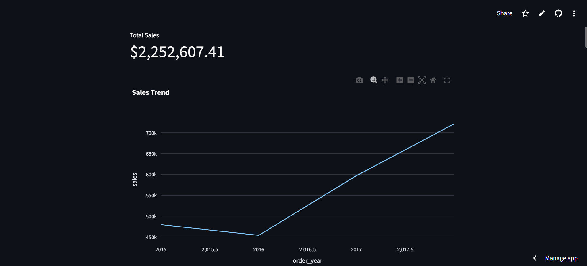
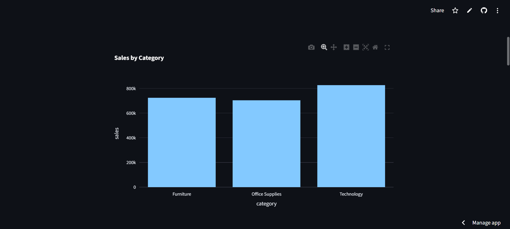
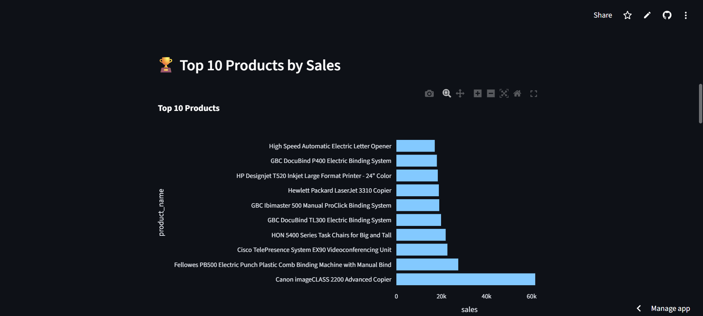
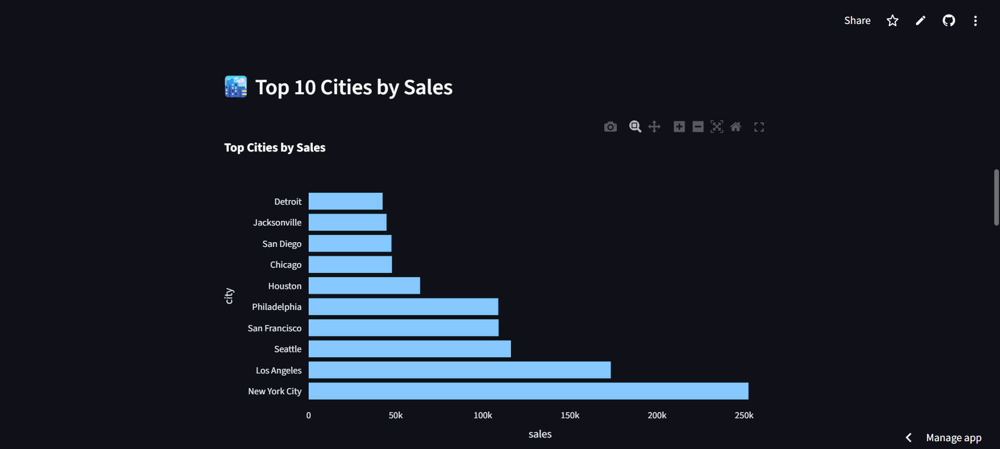

# 🚀 Zero-Touch Sales Analytics System

## 📌 Project Overview
**Zero-Touch Sales Analytics System** is an end-to-end data analytics pipeline that transforms raw sales data into actionable business insights with zero manual intervention.  

The system performs automated data cleaning, database storage, interactive dashboard visualization, forecasting, and AI-driven business insights.

---

## 🎯 Key Features

### ✅ Automated ETL Pipeline
- Extracts raw Superstore sales CSV data
- Cleans and preprocesses data automatically
- Performs feature engineering (year, month, weekday)
- Stores analytics-ready data in structured format

### Demo Screenshots

### 📊 Interactive Analytics Dashboard
- Total Sales 
- Sales trend analysis
- Sales by Category visualization
- Top Products and Cities analysis
- Monthly growth metrics

### 🔮 Sales Forecasting
- Time-series forecasting using Prophet
- Predicts future sales for next 365 days
- Visual comparison between actual and predicted sales

### 🤖 AI Auto Business Summary
- Generates insights such as:
  - Highest revenue category
  - Top performing region
  - Sales growth trends
  - Business recommendations

---

## 🛠️ Tech Stack

| Component | Technology |
|------------|-------------|
| Data Processing | Python, Pandas |
| Database | SQLite |
| Visualization | Streamlit, Plotly |
| Forecasting | Facebook Prophet |
| Automation | Windows Task Scheduler |
| Deployment | GitHub + Streamlit Cloud |

---

## 🚀 How to Run Locally
### 1️⃣ Install Dependencies
bash: 

pip install -r requirements.txt

### Run ETL Pipeline
python scripts/etl.py

python scripts/database.py

### Run Forecasting
python scripts/forecast.py

### Launch Dashboard
streamlit run dashboard/app.py

---

## ☁️ Live Demo

👉 Streamlit App: https://zero-touch-sales-analytics-zaagbzvutr6jta3azzcdpk.streamlit.app

---

## 📊 Sample Insights Generated

- Technology category generates highest revenue

- Few products contribute majority of sales (Pareto Principle)

- Certain cities dominate regional revenue

- Sales show seasonal trends

- Future sales predicted using time-series forecasting

---

## 🧠 Learning Outcomes

- End-to-end data engineering pipeline design

- Automated ETL and database integration

- Interactive BI dashboard development

- Time-series forecasting techniques

- AI-driven business insight generation

- Reproducible analytics workflow design

---

## 📌 Future Enhancements

- Real-time data streaming pipeline

- Email alerts on sales anomalies

- Airflow orchestration

- Cloud database integration (BigQuery / PostgreSQL)

- GPT-based natural language reporting

- Auto-generated PDF business reports

